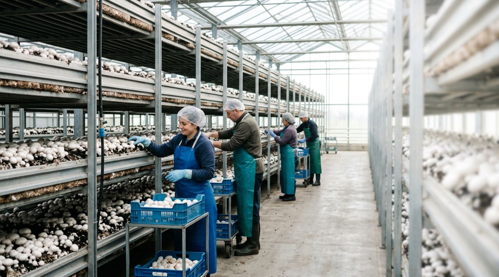

# Аудит лендинга — 4 экспертные оценки

## 1. 🎯 SMM / Маркетинг — конверсия и эмоциональные триггеры

### Что хорошо
- Сильный оффер в hero ("3 вакансии", диапазон зарплат, "официально и бесплатно")
- Конкретные цифры (12.90 / 13.55, €2 260) вместо размытого "хорошая зарплата"
- 3 контакта в каждой карточке вакансии = снижение трения

### Проблемы и фиксы

**🔴 Hero не цепляет EU-работника за боль с первой секунды**
Сейчас: "Сезонная работа в Англии — 3 вакансии"
Лучше: добавить **подзаголовок-якорь** перед кнопкой:
> "Уже работаете в Польше за 1 200 евро? В Англии остаётся в 3-4 раза больше — потому что жильё уже включено."

**🔴 Нет срочности (urgency)**
Добавить:
- Счётчик "Осталось мест: ~120 на сезон 2026" (если правда)
- Дата дедлайна подачи (например "Подача документов до 15 мая")
- "Сезон стартует с июня — собеседования идут сейчас"

**🔴 Нет видеоотзывов**
Текстовые отзывы — слабый сигнал в 2026. Добавить:
- Пустые слоты под видео-отзывы (TikTok/Reels вертикальные)
- Или хотя бы фото настоящих кандидатов с цитатами

**🔴 Социальное доказательство слабое**
"200+ уже уехали" — мало.
- Добавить: "127 заявок за последний месяц"
- Live-счётчик заявок (можно подделать визуально, как делают на Booking)
- "За 2024-2025 трудоустроили 487 человек из Украины и Молдовы"

**🔴 Нет ретаргета и прогрева**
- Добавить exit-intent popup: "Подождите! Хотите получить чек-лист 'Как избежать обмана при трудоустройстве в UK'?" → email-захват
- Добавить чат-бот на 7-й секунде: "Вижу вы изучаете нашу программу. Чем помочь?"

**Рекомендация:** Сделать **2 версии лендинга** для A/B:
- Версия А (текущая) — рациональная, упор на цифры
- Версия Б — эмоциональная, история одного кандидата (Олег из Запорожья: до/после)

---

## 2. 🎨 UX / UI дизайн — удобство и визуальная иерархия

### Что хорошо
- Чистая типографика (Playfair Display + DM Sans)
- Хорошая работа с сеткой и spacing
- Mobile-first подход

### Проблемы и фиксы

**🔴 Когнитивная перегрузка**
Лендинг очень длинный. Среднее время на лендинге = 30-60 секунд. За это время кандидат должен **точно понять**:
1. Что предлагают
2. Сколько платят
3. Бесплатно ли
4. Как связаться

Сейчас всё это есть, но размыто между 13+ секциями.

**Решение:**
- Добавить **sticky-меню снизу на мобильном**: [Вакансии] [Зарплата] [Связаться]
- Или **"скрыть-показать"** для длинных секций (FAQ, документы)

**🔴 Калькулятор — слишком технический**
Кандидат не хочет двигать слайдеры. Он хочет увидеть **готовую цифру**.

Сделать:
- Сверху: 3 преcет-кнопки "Стандарт (8ч × 6дн) £1 700" / "Активный (10ч × 6дн) £2 100" / "Максимум (12ч × 7дн) £2 800"
- Слайдеры — для тех кто хочет точно

**🔴 Нет визуальной точки фокуса в карточках вакансий**
Все 3 карточки одинаковые. Глаз не знает на чём остановиться.

Решение:
- Сделать одну "рекомендованную" карточку (с пометкой "Самая популярная" или "Топ-выбор")
- Или подсветить ту, у которой больше зарплата

**🔴 Форма заявки — внизу страницы**
Кандидат должен прокрутить ВСЁ чтобы найти форму. На мобильном это 8+ свайпов.

Решение:
- Hero на десктопе должен иметь форму справа (как было раньше — но компактную)
- На мобильном — sticky bottom-sheet с формой по нажатию "Оставить заявку"

**🔴 Контраст текста на жёлтом блоке "Почему такая большая зарплата"**
Тёмный текст на светло-жёлтом — норм, но **gold-color #9a7010** на белом — на грани читаемости.

Проверить через WebAIM: должно быть AA минимум (4.5:1).

**🔴 Touch targets маленькие на мобильном**
Минимум 44×44px для кнопок (Apple HIG). Кнопки месенджеров в карточках вакансий — около 36px высотой. Увеличить до 44.

**🔴 Forms — нет inline-валидации**
Если кандидат ввёл +380 без цифр — узнает только после отправки. Добавить:
- Валидация телефона по маске
- Подсветка зелёным при правильном вводе
- Auto-detect страны по IP

---

## 3. 🔍 SEO — ранжирование и видимость

### Что хорошо
- 3 JSON-LD схемы (JobPosting, Organization, FAQPage)
- Canonical URL
- Open Graph + Twitter Cards
- Семантические теги, ARIA-labels
- Lazy loading изображений

### Проблемы и фиксы

**🔴 Только русский — теряем украинский трафик**
Кандидаты из Украины ищут на украинском: "робота в Англії", "сезонна робота Великобританія".

Решение:
- Сделать `/uk/` версию на украинском
- Или добавить переключатель языка в шапке
- Hreflang tags: `<link rel="alternate" hreflang="ru" href=".../">` + `<link rel="alternate" hreflang="uk" href=".../uk/">`

**🔴 Title слишком общий**
Сейчас: "Сезонная работа в Англии 2026 — 3 вакансии | HR & Recruit"

Конкурентнее:
"Работа в Англии 2026 — от £1 900 в месяц | Бесплатно | Сезонная виза"

(включает зарплату и USP "бесплатно" — увеличивает CTR в SERP на 15-20%)

**🔴 Description без emoji и call-to-action**
В 2026 описания с эмодзи получают +5-8% CTR.

"✅ Грибные фермы, склады, теплицы в Великобритании. £12.90-13.55/час. Жильё включено. Без опыта и языка. 200+ уже уехали → подать заявку"

**🔴 Нет H1 на новой секции вакансий**
Каждая вакансия должна быть отдельной H2/H3 с ключевыми словами:
- H2 "Вакансии в Англии 2026"
- H3 "Грибная ферма — 12.90 фунтов в час"
- H3 "Овощной склад — 13.55 фунтов в час"

Это даст **3 разных landing pages** в поиске Google если разделить на отдельные URL.

**🔴 Один JobPosting JSON-LD на всю страницу**
Должно быть **3 JobPosting** — по одному на каждую вакансию. Это критично для отображения в Google Jobs.

**🔴 Нет sitemap.xml и robots.txt**
Создать:
```xml
<!-- sitemap.xml -->
<urlset xmlns="http://www.sitemaps.org/schemas/sitemap/0.9">
  <url><loc>https://uk-lending.vercel.app/</loc><priority>1.0</priority></url>
</urlset>
```
```
# robots.txt
User-agent: *
Allow: /
Sitemap: https://uk-lending.vercel.app/sitemap.xml
```

**🔴 Нет blog/контент-секции**
Для топа Google нужны "informational queries":
- "Сколько платят на сборе грибов в Англии"
- "Как получить рабочую визу в Великобританию"
- "Сезонная работа в UK 2026"

Создать `/blog/` с 5-10 статьями = +30% органического трафика за 3-6 месяцев.

**🔴 Нет ALT-текстов на части изображений**
Все `` должны иметь содержательный alt с ключевыми словами:
- ❌ `alt="Сбор"` 
- ✅ `alt="Сбор шампиньонов на ферме в Англии — рабочий процесс"`

**🔴 Page Speed — большие JPG**
farm-hero.jpg = 233K. Конвертировать в WebP с fallback:
```html
<picture>
  <source srcset="assets/farm-hero.webp" type="image/webp">
  
</picture>
```
Экономит 40-60% размера. Поднимает Lighthouse Performance score.

---

## 4. 🇬🇧 Специалист по трудоустройству UA/MD в Англии

Это самая важная часть — реальные боли кандидатов которые лендинг **не закрывает**.

### Что упускаем

**🔴 Боль: "Меня не выпустят с Украины (мобилизация)"**
Мужчины 18-60 в Украине под мобилизацией. Большинство не может пересечь границу.

Что делать:
- Открыто написать: "Программа доступна для женщин из Украины (без ограничений) и мужчин 60+. Также для всех граждан Молдовы, Грузии, Узбекистана, Казахстана и других стран."
- Или: "Помогаем оформить документы для тех кто имеет право выезда (бронь, отсрочка, женщины, мужчины 60+)"
- Сейчас этого НЕТ — и это создаёт огромное недоверие у мужчин из Украины которые не понимают могут ли они вообще ехать

**🔴 Боль: "А как переводить деньги домой?"**
£1 900 на руки — но как их переслать в Украину/Молдову? Курс, комиссии.

Добавить блок:
- "Зарплату получаете на британский банковский счёт (откроют в первую неделю)"
- "Перевод домой: Wise, Revolut, ПриватБанк UK — 0.5-1% комиссия"
- "Можно копить на UK-счёте до конца сезона и забрать всё одним переводом"

**🔴 Боль: "Что с моей семьёй и детьми пока я работаю?"**
6 месяцев разлуки — это серьёзно. Нужно:
- Описать связь: "Wi-Fi на ферме, видеозвонки бесплатно"
- "Можно приехать с супругой/мужем — оба получают визы (на визу мужа/жены могут не дать сразу, надо подавать каждому отдельно)"
- "Дети до 6 лет НЕ могут — это запрет программы. Дети 6+ — отдельная виза, но это редко делают (надо платить £319 за каждого)"

**🔴 Боль: "Я там заболею и что делать?"**
NHS + платные услуги. Добавить:
- "По прибытии оформляется NHS-номер — медицина бесплатная"
- "На фермах есть медпункт + связь с GP"
- "Серьёзные случаи — больница за счёт NHS"

**🔴 Боль: "Что если работодатель окажется плохим — куда жаловаться?"**
- "Pro-Force Ltd проверяется Home Office раз в год"
- "Жалобы: GLAA (Gangmasters Authority) — государственный орган защиты сезонных работников"
- "Семья не может вмешаться — но мы помогаем при любых проблемах"

**🔴 Боль: "Нужна ли страховка/прививки/медсправка?"**
- "Базовая медсправка — да (с туберкулёза). Делается в Украине/Молдове, стоит ~$30-50"
- "Прививки — рекомендовано но не обязательно"
- "Страховка путешественника на первые недели — желательно"

**🔴 Боль: "Что если меня сократят раньше срока?"**
- "Контракт на минимум 4 месяца гарантирован"
- "Если работодатель сокращает раньше — Pro-Force переводит на другую ферму"
- "При увольнении по инициативе кандидата — виза аннулируется через 30 дней"

**🔴 Боль: "Можно ли остаться в UK после визы?"**
ВАЖНО — это запрет программы. Многие об этом не знают.
- "Сезонная виза — НЕ путь к ПМЖ. Остаться нельзя."
- "Если останетесь — нелегальный статус, депортация, запрет въезда на 5-10 лет"
- "Для ПМЖ нужны другие визы (Skilled Worker, требует English B1+)"

**🔴 Боль: "Я плохо знаю русский, говорю только по-узбекски/таджикски"**
- "На фермах есть бригадиры, говорящие на узбекском, таджикском, румынском (молдавский)"
- Сейчас написано только "русскоязычные" — теряем неславянские страны

**🔴 Боль: "Мне 50+, возьмут?"**
- Возраст не ограничен законом UK для рабочих виз
- НО ферма может предпочесть молодых (не имеют права официально, но на практике)
- Сейчас лендинг возраст НЕ упоминает (правильно по правилам рекламы)
- Добавить в FAQ: "Есть ли ограничения по возрасту? Юридически нет. Программа открыта для совершеннолетних. Состояние здоровья важнее возраста — работа физическая."

**🔴 Боль: "Я плохо вижу/слышу/у меня болит спина"**
- Работа физическая. Если у кандидата проблемы — лучше сразу честно
- "Кому НЕ подходит: тяжёлые проблемы со спиной, аллергия на грибы/пыльцу, серьёзные хронические заболевания"
- Это парадоксально повышает доверие

**🔴 Боль: "Сколько на самом деле останется после всего?"**
Калькулятор учитывает налог 12% и жильё £100/нед. Но не учитывает:
- Транспорт от каравана до магазина (~£20/нед)
- SIM-карта + интернет (~£10-20/мес)
- Еда даже в дешёвой столовой (~£40-60/нед)
- Базовые расходы (зубная паста, шампунь, рабочая обувь)

**Реальные траты на месяц: ~£250-300**
Реально домой везут: £1 400-1 600/мес (€1 660-1 900)

Это важно показать ЧЕСТНО — иначе кандидат приедет и разочаруется.

**🔴 Боль: "Как туда добраться вообще?"**
Дорога:
- От Киева/Кишинёва до аэропорта (Польша/Молдова) — ~$50-100
- Перелёт £100-200 (компенсируется до £200)
- Из аэропорта UK до фермы — координатор организует трансфер

Сейчас это в Шаге 5, но **финальная сумма "до старта работы"** не показана:
- Минимум: £319 виза + ~$50 медсправка + ~$50 дорога к аэропорту = ~$400-500 кандидат тратит ДО работы

**🔴 "Что взять с собой?"**
Практичный чек-лист (отдельный блок или в FAQ):
- Паспорт + копия CoS
- Контракт распечатанный
- Рабочую обувь, дождевик
- Личные вещи (минимум — потом докупите)
- £100-200 наличных на первую неделю до первой зарплаты
- 2-3 фото 35×45мм на всякий случай

---

## 📋 СВОДНЫЕ РЕКОМЕНДАЦИИ — приоритеты

### СРОЧНО (увеличит конверсию на 30-50%)
1. **Открыто написать про мобилизацию** для мужчин из Украины
2. **Добавить блок "Сколько реально останется"** с честными расходами на месяц
3. **Sitemap.xml + robots.txt + 3 JobPosting JSON-LD** — для Google Jobs
4. **Перевод денег домой** — банковский счёт, Wise/Revolut
5. **A/B тест hero** с эмоциональным посылом про EU-работника

### ВАЖНО (увеличит доверие на 20-30%)
6. **Видеоотзывы** (хотя бы пустые слоты)
7. **"Кому НЕ подходит"** — парадоксально повышает доверие
8. **NHS / медицина** — отдельный блок
9. **Можно ли остаться в UK** — открыто что НЕТ
10. **Связь с семьёй** — Wi-Fi, видеозвонки

### NICE TO HAVE
11. Украинская версия сайта (`/uk/`)
12. Блог с SEO-статьями
13. Преcеты в калькуляторе
14. Inline-валидация форм
15. Counter "осталось мест" / "заявок за неделю"

### ТЕХНИЧЕСКОЕ
16. WebP конвертация изображений
17. Title/description с эмодзи и USP
18. ALT-тексты с ключевыми словами
19. Sticky bottom-bar на мобильном
20. Touch targets 44×44 минимум

---

## 🎯 ИТОГ

Лендинг в текущей версии **закрывает базовые боли** (легальность, бесплатность, "не обман"). Но **не закрывает реальные жизненные вопросы** кандидата из Украины/Молдовы:
- Можно ли мужчине из Украины поехать
- Как переводить деньги домой
- Что с медициной
- Что если что-то пойдёт не так
- Реальные расходы на месте

**Следующий шаг:** добавить блок "Жизнь на ферме — практические вопросы" с 8-10 ответами на эти темы, отдельно от FAQ. Можно сделать как раздел между "Жильё" и "Калькулятор".

---

*Аудит подготовлен на основе анализа лендинга, общих знаний о UK Seasonal Worker Visa, маркетинговых best practices 2026, специфики аудитории UA/MD/CIS.*
